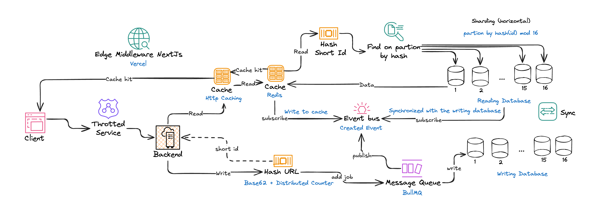

# SuperShort

## Mục lục

- [SuperShort](#supershort)
  - [Mục lục](#mục-lục)
  - [Thành viên](#thành-viên)
  - [Demo](#demo)
  - [Tổng quan](#tổng-quan)
    - [Tính năng chính](#tính-năng-chính)
    - [Vấn đề](#vấn-đề)
      - [1. URLs dài và phức tạp](#1-urls-dài-và-phức-tạp)
      - [2. Thách thức về hiệu năng](#2-thách-thức-về-hiệu-năng)
  - [Các chiến lược tối ưu](#các-chiến-lược-tối-ưu)
    - [Chiến lược tạo id](#chiến-lược-tạo-id)
      - [**Mã hoá Base62**](#mã-hoá-base62)
      - [**Distributed Counter**](#distributed-counter)
      - [**Phân vùng thông minh**](#phân-vùng-thông-minh)
    - [Chiến lược cache](#chiến-lược-cache)
      - [Triển khai cache-server bằng Redis](#triển-khai-cache-server-bằng-redis)
      - [Triển khai cache-client bằng Edge Middleware](#triển-khai-cache-client-bằng-edge-middleware)
    - [Chiến lược Message Queue](#chiến-lược-message-queue)
      - [Xử lý ghi bất đồng bộ](#xử-lý-ghi-bất-đồng-bộ)
      - [Nâng cao độ tin cậy và khả năng chịu lỗi](#nâng-cao-độ-tin-cậy-và-khả-năng-chịu-lỗi)
    - [Chiến lược CQRS](#chiến-lược-cqrs)
      - [Command](#command)
      - [Query](#query)
    - [Mở rộng với Rate Limiting và Edge Middleware](#mở-rộng-với-rate-limiting-và-edge-middleware)
  - [Kiến trúc](#kiến-trúc)
  - [Công nghệ sử dụng](#công-nghệ-sử-dụng)
  - [Kiểm thử và đánh giá](#kiểm-thử-và-đánh-giá)

## Thành viên

1. Hoàng Đức Bách - 22021210
2. Lê Vũ Việt Anh - 22021212
3. Bằng Văn Chiến - 22021195

## Demo

- App: <https://supershort-khaki.vercel.app/>
- Api: <https://decisive-cherie-bach-fae494b4.koyeb.app/api/v1>

## Tổng quan

SuperShort là dịch vụ rút gọn URL hiệu suất cực cao. Hệ thống sử dụng các mẫu kiến ​​trúc được tối ưu hóa để đảm bảo khả năng mở rộng, độ tin cậy và hiệu suất trong khi vẫn duy trì hiệu quả về chi phí.

### Tính năng chính

- **Rút gọn URL**: Chuyển đổi các URL dài thành liên kết ngắn, dễ quản lý
- **Chuyển hướng URL**: Chuyển hướng liền mạch từ liên kết đã rút gọn đến URL gốc

### Vấn đề

#### 1. URLs dài và phức tạp

- Khó chia sẻ, nhập sai và không thẩm mỹ
- Vượt quá giới hạn ký tự trên nhiều nền tảng
  
#### 2. Thách thức về hiệu năng

- Cần xử lý nhiều yêu cầu chuyển hướng với độ trễ thấp
- Yêu cầu đọc nhiều hơn ghi (tỷ lệ khoảng 10:1)

## Các chiến lược tối ưu

### Chiến lược tạo id

Sử dụng mã hóa **Base62** kết hợp với **Distributed Counter** để tạo ra ID duy nhất, vừa ngắn gọn, vừa có thể dùng làm short link mà không cần thêm lớp ánh xạ trong database.

#### **Mã hoá Base62**

- Đảm bảo số lượng lớn, ≈$3.5^{12}$ trước khi đệm thêm ```nonce```
- Đảm bảo độ dài tối là 7 kí tự

#### **Distributed Counter**

- Dùng để tạo ```nonce``` tăng dần độc nhất cho id
- Đảm bảo không có xung đột id

#### **Phân vùng thông minh**

- Hỗ trợ dùng chính short id để tính toán partion và phân tán lên database
- Phân tán đều các ID trên các partition (**SuperShort** hiện dùng 16 bảng) khác nhau (0-15)
- Tối ưu hóa việc sharding và truy vấn song song

> Hiệu quả
>
> - Ngắn gọn nhờ Base62
> - Duy nhất nhờ counter phân tán
> Dễ dàng dự đoán phân vùng lưu trữ dựa trên short id mà không cần lookup database
>

### Chiến lược cache

Để giảm độ trễ truy cập và giảm tải hệ thống:

#### Triển khai cache-server bằng Redis

- **Redis** được dùng như cache phía server, giúp truy xuất URL gốc nhanh hơn rất nhiều khi short URL đã từng được truy cập.
- Redis sử dụng chính short ID làm key và URL gốc làm value.
- Áp dụng thuật toán **Least Recently Used (LRU)** để giải phóng bộ nhớ khi cache đầy (hỗ trợ hàng trăm ngàn cặp key-value).

#### Triển khai cache-client bằng Edge Middleware

- **Edge Middleware** của Next.js hỗ trợ kiểm tra short URL từ phía client trước khi gửi yêu cầu về backend, từ đó:
  - Giảm thời gian phản hồi.
  - Tránh cần thiết phải gọi API nếu đã có dữ liệu

> - Cải thiện đáng kể thời gian truy xuất URL gốc từ short URL
> - Cho phép lưu trữ hơn 100.000 cặp key-value, sử dụng thuật toán LRU khi bộ nhớ đầy
> - Thực thi tại biên (edge location), rất gần người dùng với edge network lớn của Vercel

### Chiến lược Message Queue

Để xử lý tác vụ ghi dữ liệu một cách bất đồng bộ, tách biệt khỏi luồng xử lý yêu cầu chính, nâng cao khả năng đáp ứng và độ tin cậy của hệ thống:

#### Xử lý ghi bất đồng bộ

- Short Id sẽ được gen ra trước (<0.5ms) sau đó tạo job để thực thi async command, và ngay lập tức response cho client short id
- Thực hiện command dưới dạng một job được đẩy vào mq và thực hiện bất đồng bộ

#### Nâng cao độ tin cậy và khả năng chịu lỗi

- Tích hợp cơ chế retry giảm thiểu nguy cơ mất dữ liệu
  
> - Giảm độ trễ cho API tạo short link, phản hồi người dùng cực nhanh (chỉ thực hiện hash id).
> - Tăng khả năng chịu lỗi của hệ thống khi tương tác với database.
> - Cho phép xử lý lưu lượng ghi cực lớn thông qua xử lý nền và khả năng mở rộng worker độc lập.

### Chiến lược CQRS

Để tối ưu hoá throughput và khả năng mở rộng:

#### Command

- Thao tác với Writing Database
  - Schema dành riêng cho lưu trữ (short id, long url, timestamp cũng như các metadata)
  
#### Query

- Thao tác với Reading Database
  - Schema đơn giản chỉ gồm short id và long url, giảm tải database để tăng tốc độ truy vấn và tối ưu lưu trữ
  
> - Giảm thiểu xung đột đọc/ghi, đặc biệt với hệ thống có tỷ lệ đọc rất cao (~90%)
> - Cho phép mở rộng phần đọc để xử lý hàng nghìn request/giây
> - Dễ kiểm soát logic và bảo trì mỗi phần riêng biệt

### Mở rộng với Rate Limiting và Edge Middleware

> - Rate Limiting được áp dụng để hạn chế người dùng liên tục gửi yêu cầu làm tắc nghẽn hệ thống
> - Edge function giúp người dùng truy cập được short URL nhanh hơn bởi thông tin đườn cho hệ thống

## Kiến trúc



## Công nghệ sử dụng

- **Frontend**  
  - Sử dụng **Next.js**  
  - Triển khai với **Edge Middleware** trên **Vercel** để tối ưu tốc độ redirect phía client

- **Backend**  
  - Phát triển bằng **NestJS**  
  - Tích hợp **Redis** (dùng làm distributed counter & caching)  
  - Áp dụng mô hình **CQRS** để tách biệt xử lý đọc và ghi

- **ID Generation Strategy**  
  - Kết hợp **Base62 encoding** và **Redis-based Distributed Counter**  

- **Caching**  
  - **Edge Middleware** của Next.js giúp client redirect
  - **Redis cache** phía server tăng tốc độ truy xuất URL gốc, giảm tải database

- **Database**  
  - Sử dụng **PostgreSQL**  
  - Áp dụng **partitioning theo hash của short ID** để sharding và tăng hiệu năng truy vấn

## Kiểm thử và đánh giá

<https://docs.google.com/document/d/1OmMA4huyNbtOYlZ4iqP40iGQ5OTi7vMwAJn4hrSrwOA/edit?usp=sharing>
# supershort-platform
